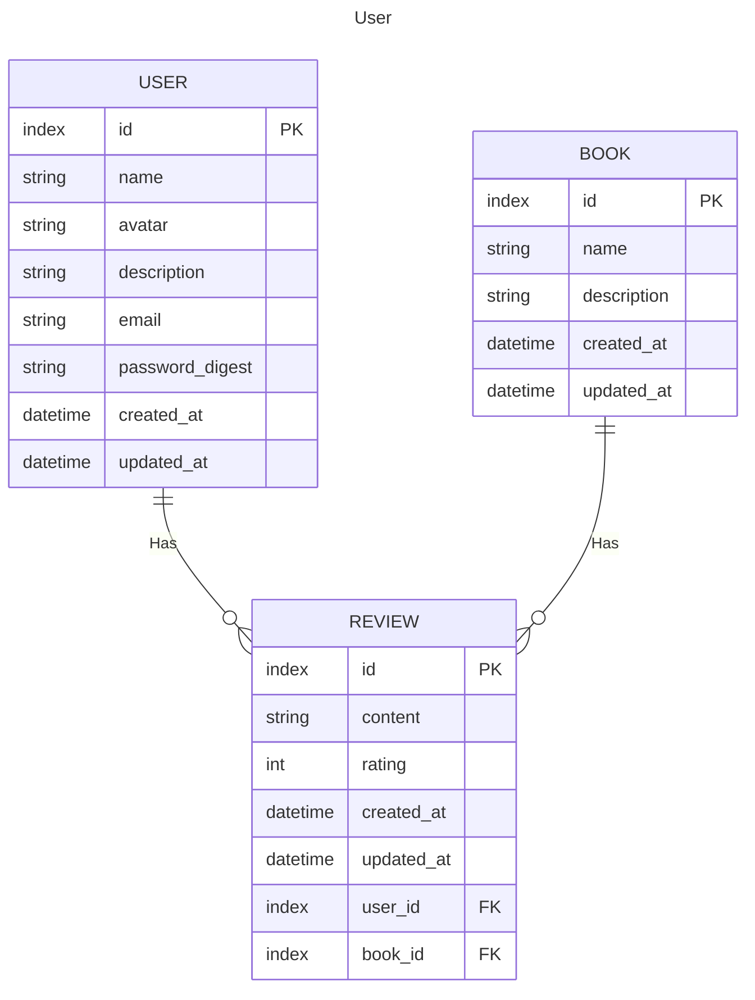

```mermaid
---
title: User
---
erDiagram
    USER {
        index id PK
        string name
        string avatar
        string description
        string email
        string password_digest
        datetime created_at
        datetime updated_at
    }

    BOOK {
        index id PK
        string name
        string description
        datetime created_at
        datetime updated_at
    }

    REVIEW {
        index id PK
        string content
        int rating
        datetime created_at
        datetime updated_at
        index user_id FK
        index book_id FK
    }

    USER ||--o{ REVIEW : "Has"
    BOOK ||--o{ REVIEW : "Has"

```